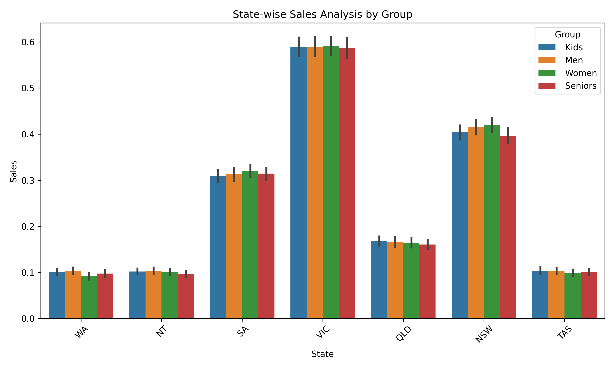
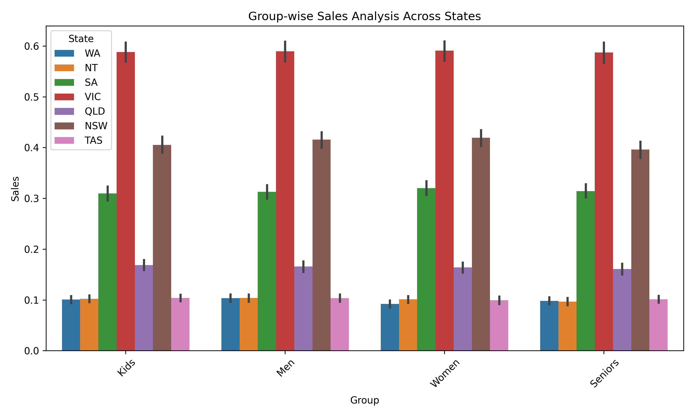
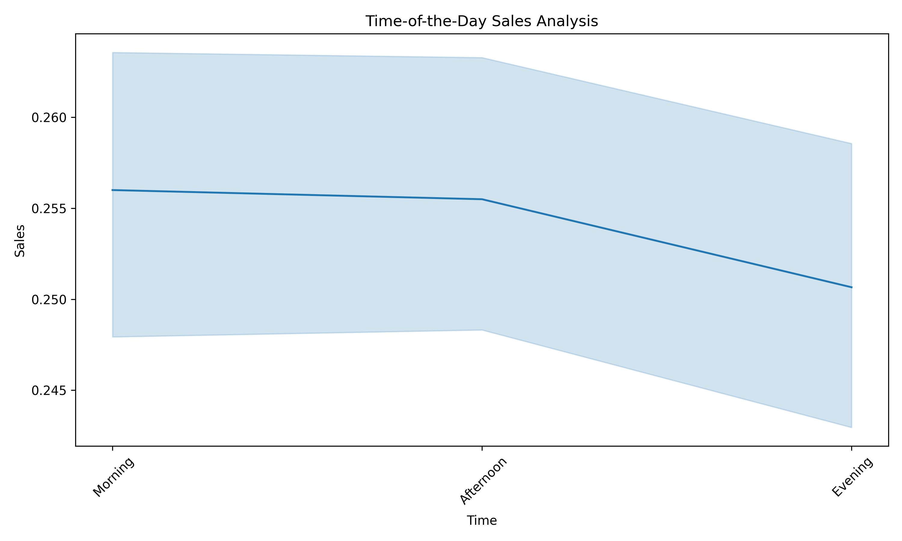

# 📊 Sales-Analysis-AAL-Q4-2020

## 🔍 Overview
This project analyzes AAL’s 4th quarter sales data (2020) to uncover insights across
states, demographic groups, and time periods using Python data analytics.

## 🛠 Tools & Technologies
- Python
- Pandas, NumPy
- Matplotlib, Seaborn
- Scikit-learn
- Jupyter Notebook

## 📁 Project Structure
Sales-Analysis-AAL-Q4-2020/
├── data/
├── notebooks/
├── images/
├── reports/

## 📈 Key Insights
- Victoria (VIC) recorded the highest sales
- Western Australia (WA) recorded the lowest sales
- December was the best-performing month
- Morning hours generated the highest sales
- Seniors and Women were top customer segments

## 📊 Visualizations
### State-wise Sales by Demographic

### Group-wise Sales Across States

### Time-of-Day Sales Analysis

## 👤 Author
**Mohammed Mufaqqam Sanjar Ghori**  
MSc Data Science, AI & Digital Business
